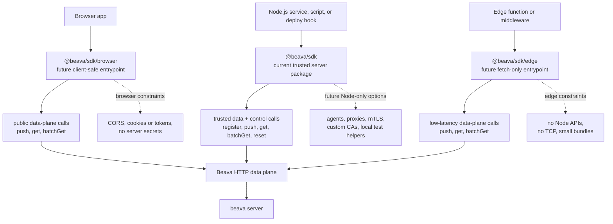

# beava-js Architecture

## Runtime Strategy

The current JavaScript implementation ships as the single `@beava/sdk` package with a shared fetch-based HTTP client.

The Node SDK is the only active package today. The intended long-term shape is one canonical SDK with runtime-specific entrypoints:

| Entrypoint           | Status | Runtime                                                                              | Intended surface                                                                                                                                                           |
| -------------------- | ------ | ------------------------------------------------------------------------------------ | -------------------------------------------------------------------------------------------------------------------------------------------------------------------------- |
| `@beava/sdk`         | Active | Trusted Node.js services and scripts                                                 | Full control-plane and data-plane API: `register`, `push`, `get`, `batchGet`, `reset`, plus future Node-specific HTTP tuning.                                              |
| `@beava/sdk/node`    | Future | Trusted Node.js services and scripts                                                 | Explicit Node entrypoint if the default package later becomes universal.                                                                                                   |
| `@beava/sdk/browser` | Future | Browser bundles                                                                      | Public/client-safe API focused on `push`, `get`, and `batchGet`. No server secrets, no local server helpers, and no default exposure of destructive test/admin operations. |
| `@beava/sdk/edge`    | Future | Edge runtimes such as Vercel Edge, Cloudflare Workers, Deno Deploy, and Netlify Edge | Small fetch-only API for low-latency `push`, `get`, and `batchGet`. No Node APIs, no TCP transport, no filesystem access, and no long-running registration workflows.      |

Until runtime-specific entrypoints exist, treat `@beava/sdk` as the trusted server-side package. Do not assume any browser-facing package enforces a narrower API at runtime yet.

## Runtime Boundaries

The runtime split is about trust and platform capability, not just import names.

Node.js code is trusted server-side code. It can hold credentials, register pipeline descriptors during deploy or startup, call test-mode reset in controlled environments, and eventually use Node-specific HTTP controls such as custom agents, proxies, custom certificate authorities, mTLS, or keep-alive tuning.

Browser code is public client-side code. It cannot hold server secrets, must operate within CORS and browser credential rules, and should avoid exposing control-plane or destructive operations. A future browser entrypoint should focus on event writes and feature reads.

Edge runtime code is server-side but not Node.js. It usually has standard `fetch`, but not Node APIs such as `fs`, raw TCP sockets, or Node HTTP agents. A future edge entrypoint should stay small, fetch-only, and oriented around low-latency `push`, `get`, and `batchGet` paths.

## Current Package Interpretation

`@beava/sdk` currently contains the implementation and should be documented as the trusted server-side package.

Do not add divergent behavior just for naming symmetry. Split implementation only when the runtime needs a real difference in API surface, dependency graph, transport behavior, authentication model, or bundle constraints.